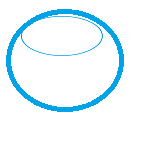

# HedgeEA - Expert Advisor for MetaTrader 4



یک اکسپرت هدجینگ پیشرفته برای متاتریدر 4 که با مدیریت ریسک هوشمند و فیلترهای معاملاتی کار می‌کند.

## 📊 ویژگی‌های اصلی

- **مدیریت ریسک پیشرفته**
  - محدودیت ضرر روزانه و هفتگی
  - محاسبه حجم پویا بر اساس ریسک
  - مدیریت مارجین هوشمند
  - محاسبه خودکار حجم بر اساس درصد ریسک حساب

- **فیلترهای معاملاتی**
  - فیلتر سشن‌های معاملاتی (آسیا، لندن، نیویورک)
  - فیلتر اخبار
  - محدودیت زمان معاملات
  - فیلتر حجم معاملات

- **مدیریت پوزیشن**
  - هدجینگ خودکار
  - تریلینگ استاپ
  - بستن خودکار پوزیشن‌های قدیمی
  - مدیریت چندین پوزیشن همزمان

- **گزارش‌دهی**
  - گزارش سود روزانه و هفتگی
  - نمایش وضعیت سشن معاملاتی
  - لاگ‌های دقیق عملیات
  - نمودار عملکرد

## 🚀 نصب

1. فایل `HedgeEA.mq4` را در پوشه `Experts` متاتریدر خود کپی کنید
   ```
   C:\Users\[YourUsername]\AppData\Roaming\MetaQuotes\Terminal\[YourMT4ID]\MQL4\Experts
   ```
2. متاتریدر را باز کنید
3. اکسپرت را به چارت اضافه کنید
4. پارامترهای مورد نظر خود را تنظیم کنید

## ⚙️ پارامترهای قابل تنظیم

### مدیریت ریسک
| پارامتر | توضیحات | مقدار پیش‌فرض |
|---------|---------|--------------|
| `LotSize` | حجم معامله | 0.1 |
| `HedgeLotSize` | حجم معامله هدج | 0.1 |
| `StopLoss` | حد ضرر به پیپ | 50 |
| `TakeProfit` | حد سود به پیپ | 100 |
| `MaxLossPercent` | درصد ضرر مجاز قبل از هدجینگ | 1.0 |
| `TargetProfit` | درصد سود هدف برای بستن تمام پوزیشن‌ها | 2.0 |
| `DailyLossLimit` | محدودیت ضرر روزانه (درصد) | 5.0 |
| `WeeklyLossLimit` | محدودیت ضرر هفتگی (درصد) | 10.0 |

### فیلترهای معاملاتی
| پارامتر | توضیحات | مقدار پیش‌فرض |
|---------|---------|--------------|
| `StartHour` | ساعت شروع معاملات | 0 |
| `EndHour` | ساعت پایان معاملات | 24 |
| `UseNewsFilter` | فعال/غیرفعال کردن فیلتر اخبار | true |
| `NewsMinutesBefore` | دقیقه قبل از اخبار برای عدم معامله | 30 |
| `NewsMinutesAfter` | دقیقه بعد از اخبار برای عدم معامله | 30 |
| `UseSessionFilter` | فعال/غیرفعال کردن فیلتر سشن‌ها | true |
| `AsianSession` | سشن آسیا | 0-8 |
| `LondonSession` | سشن لندن | 8-16 |
| `NewYorkSession` | سشن نیویورک | 13-21 |

### مدیریت پوزیشن
| پارامتر | توضیحات | مقدار پیش‌فرض |
|---------|---------|--------------|
| `UseTrailingStop` | فعال/غیرفعال کردن تریلینگ استاپ | true |
| `TrailingStop` | مقدار تریلینگ استاپ به پیپ | 20 |
| `TrailingStep` | گام تریلینگ استاپ به پیپ | 10 |
| `MaxPositionAge` | حداکثر سن پوزیشن به ساعت | 24 |

## 💡 استفاده

1. اکسپرت را به چارت اضافه کنید
2. پارامترهای مورد نظر خود را تنظیم کنید
3. اکسپرت به صورت خودکار:
   - پوزیشن‌ها را مدیریت می‌کند
   - در صورت نیاز هدج می‌کند
   - تریلینگ استاپ را اعمال می‌کند
   - پوزیشن‌های قدیمی را می‌بندد

### مثال تنظیمات
```mql4
// مدیریت ریسک
LotSize = 0.1;
MaxLossPercent = 1.0;
DailyLossLimit = 5.0;

// فیلترها
UseNewsFilter = true;
NewsMinutesBefore = 30;
UseSessionFilter = true;

// مدیریت پوزیشن
UseTrailingStop = true;
TrailingStop = 20;
```

## ⚠️ محدودیت‌ها

- فقط در متاتریدر 4 کار می‌کند
- نیاز به اتصال اینترنت برای فیلتر اخبار
- ممکن است در برخی بروکرها محدودیت داشته باشد
- نیاز به حداقل موجودی حساب برای معاملات

## 🤝 مشارکت

مشارکت‌های شما برای بهبود این پروژه بسیار ارزشمند است. لطفاً:

1. این مخزن را فورک کنید
2. یک شاخه جدید ایجاد کنید
3. تغییرات خود را اعمال کنید
4. یک درخواست کشش (Pull Request) ارسال کنید

### راهنمای مشارکت
- کد خود را با دقت تست کنید
- مستندات را به‌روز کنید
- از استانداردهای کدنویسی پیروی کنید

## 📜 لایسنس

این پروژه تحت لایسنس MIT منتشر شده است. برای جزئیات بیشتر فایل [LICENSE](LICENSE) را ببینید.

## 💖 حمایت

اگر این پروژه برای شما مفید بوده است، لطفاً با دادن ستاره از آن حمایت کنید. 

## 📞 تماس با ما

- ایمیل:(sahebkaran@gmail.com)
- تلگرام: [@your-telegram](https://t.me/sahebkaran)
- وبسایت: [your-website.com](https://your-website.com)

## 🙏 تشکر

از تمام کسانی که در توسعه این پروژه مشارکت کرده‌اند تشکر می‌کنیم.
